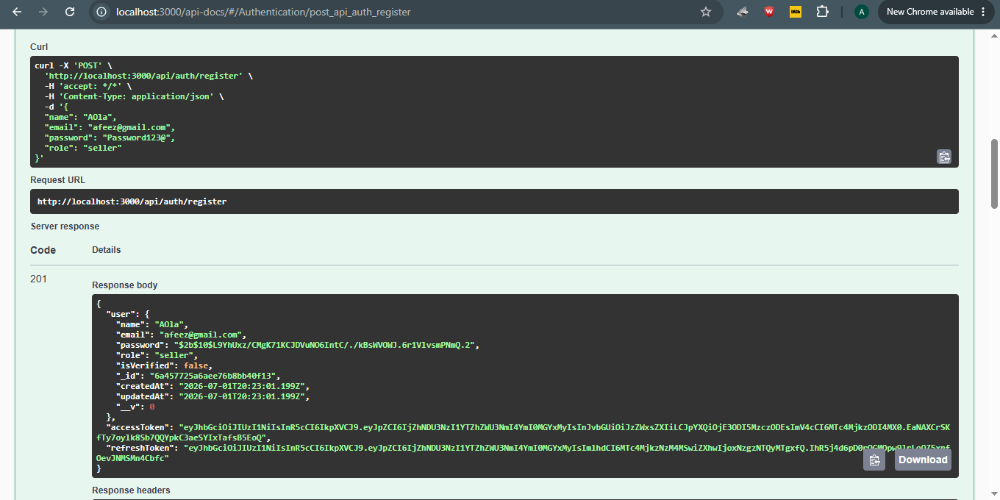
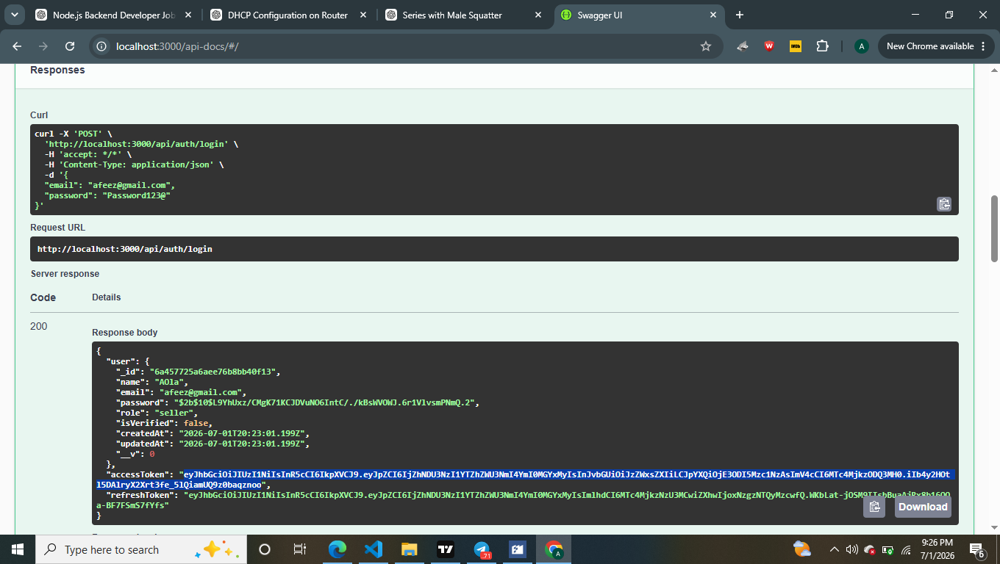
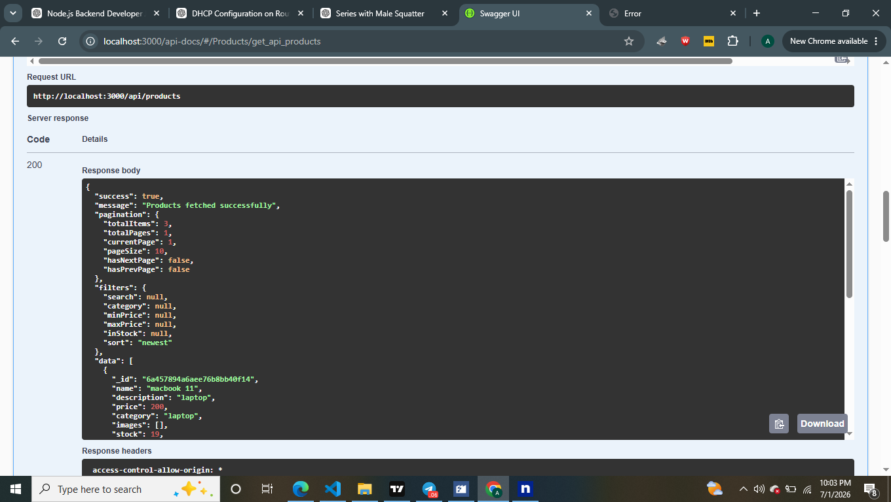
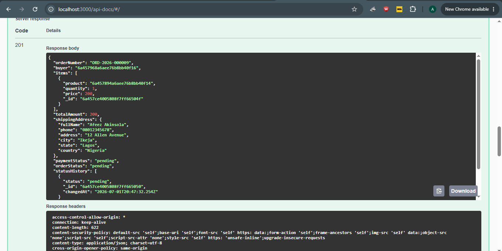
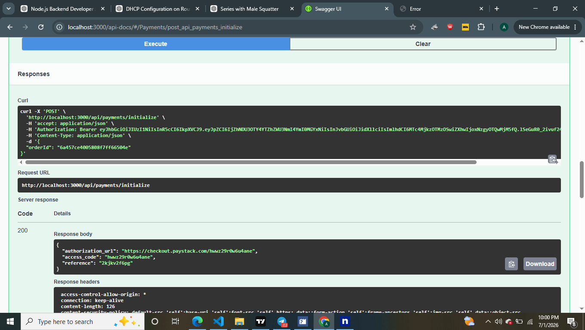
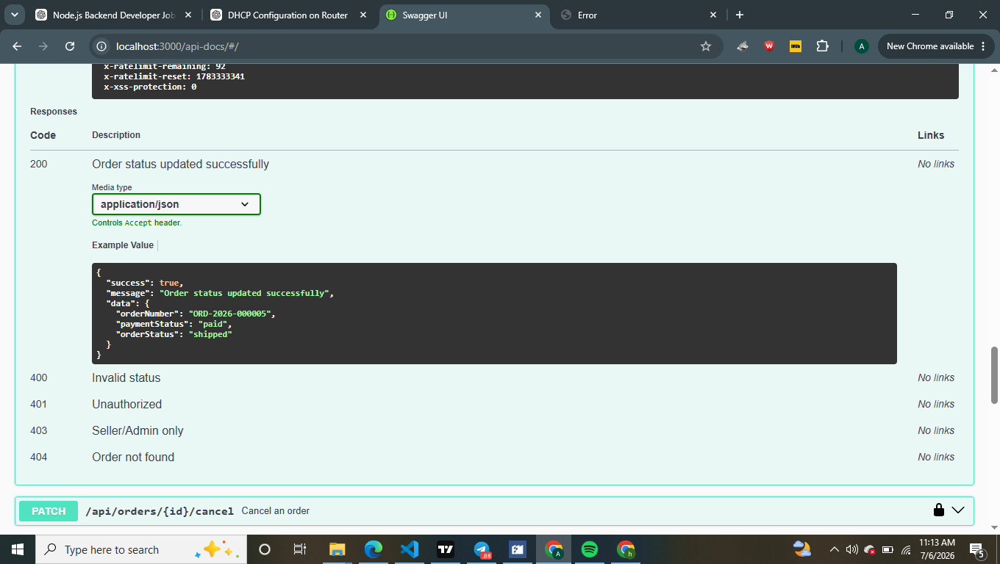
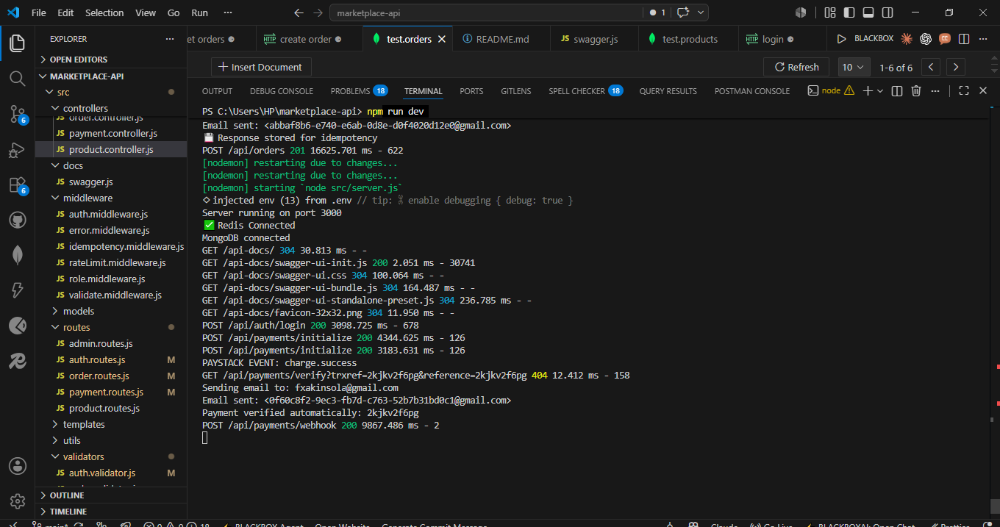

# Marketplace API

A production-ready **Marketplace REST API** built with **Node.js**,
**Express.js**, **MongoDB**, **Redis Cloud**, **Paystack**, and
**Resend**. It demonstrates authentication, role-based authorization,
product management, order processing, payment integration, caching,
idempotency, aggregation pipelines, email notifications, and interactive
Swagger documentation.

## Live Demo

- **API:** https://marketplace-api-xxad.onrender.com
- **Swagger Docs:** https://marketplace-api-xxad.onrender.com/api-docs

> **Email Notice**
>
> This project uses **Resend** for transactional emails. The deployed
> demo currently uses Resend's free developer configuration without a
> verified custom domain. As a result, email delivery is limited to
> verified recipients associated with the Resend account. The email
> integration is fully implemented and works correctly. To enable
> delivery to any email address, simply verify a custom domain in Resend
> and update the `FROM_EMAIL` environment variable.

---

# Features

## Authentication

- User Registration
- User Login
- JWT Authentication
- Role-based Authorization (Admin, Seller, Buyer)
- Password Hashing (bcrypt)

## Products

- Create Product
- Update Product
- Delete Product
- Get Single Product
- Get All Products

### Advanced Query Features

- Search
- Pagination
- Sorting
- Category Filtering
- Price Filtering
- Stock Filtering

## Orders

- Create Order
- Get User Orders
- Get Seller Orders
- Cancel Order
- Update Order Status
- Status History
- MongoDB Transactions
- Automatic Order Number Generation

## Payments

- Paystack Payment Initialization
- Payment Verification
- Webhook Support
- Automatic Order Updates

## Email Notifications

- Order Created
- Payment Successful
- Order Processing
- Order Shipped
- Order Delivered

Powered by **Resend**.

## Redis

- Product Cache
- Cache Invalidation
- Faster Response Times

## Admin & Seller Analytics

- Dashboard Statistics
- Revenue Analytics
- Seller Analytics
- MongoDB Aggregation Pipelines

## Idempotency

Order creation supports idempotency to prevent duplicate orders using
the `Idempotency-Key` header.

## Security

- Helmet
- HPP
- express-rate-limit
- express-mongo-sanitize
- JWT
- bcrypt

---

# API Documentation

Interactive Swagger UI is available at:

https://marketplace-api-xxad.onrender.com/api-docs

---

# Tech Stack

- Node.js
- Express.js
- MongoDB
- Mongoose
- Redis Cloud
- JWT
- Multer
- Paystack
- Resend
- Swagger/OpenAPI

---

# Project Structure

```text
src/
├── config/
├── controllers/
├── middleware/
├── models/
├── routes/
├── templates/
├── utils/
├── uploads/
├── app.js
└── server.js
```

---

# Environment Variables

```env
PORT=3000

MONGO_URI=your_mongodb_connection_string

JWT_SECRET=your_jwt_secret

RESEND_API_KEY=your_resend_api_key

FROM_EMAIL=onboarding@resend.dev

PAYSTACK_SECRET_KEY=your_paystack_secret_key

PAYSTACK_PUBLIC_KEY=your_paystack_public_key

PAYSTACK_WEBHOOK_SECRET=your_paystack_webhook_secret

REDIS_URL=your_redis_cloud_url
```

---

# Installation

```bash
git clone https://github.com/Harfies/marketplace-api.git
cd marketplace-api
npm install
npm run dev
```

---

# Testing

You can test the API using:

- Swagger UI
- Postman
- Thunder Client
- Insomnia

---

## Screenshots

### Register



### Login



### Products



### Orders



### Payments



### Update Order Status



### Idempotency



---

# Performance Optimizations

- Redis Caching
- Pagination
- Aggregation Pipelines
- MongoDB Indexes
- Lean Queries

---

# Production Features

- JWT Authentication
- Role Authorization
- Redis Cloud
- Paystack
- Resend Email
- MongoDB Transactions
- Idempotency
- Swagger Documentation
- Error Handling
- Logging

---

# Future Improvements

- Docker
- CI/CD
- BullMQ
- Jest Tests
- Refresh Tokens
- OAuth
- Kubernetes
- Prometheus & Grafana

---

# Author

**Afeez Akinsola**

Backend Developer (Node.js)

- GitHub: https://github.com/Harfies
- Email: akinsolaafeez82@gmail.com
